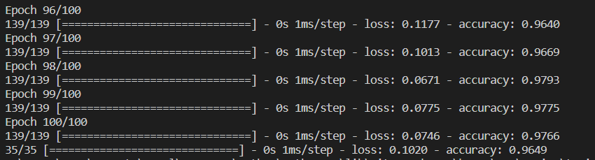
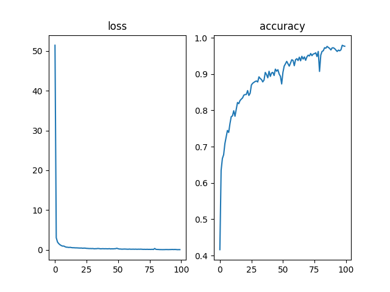
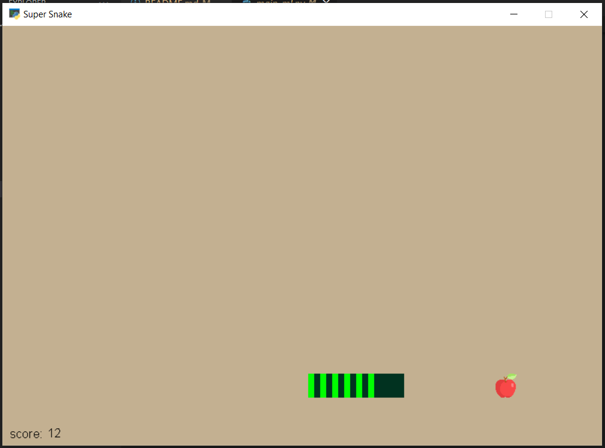

<h3>Snake Game with AI</h3>

# Description

In this project, first, the snake automatically moves towards the apple with rules (if, else, ...) and the information needed to produce the dataset is collected and stored.
This information includes the distance of the snake from the walls, the coordinates of the snake, the coordinates of the apple and the presence or absence of the apple around the snake.

# How to install

pip install -r requirements.txt

# How to run

First run generate_dataset.py.
Then run train.py to train neural network.
Finally run main_ml.py to see the result.

# Results

